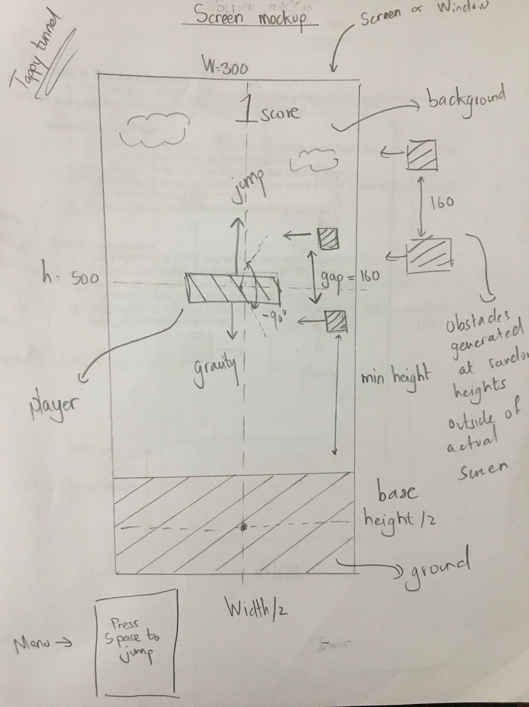

# Final Project - Tappy Tunnel
## 1. Objective of the game

Tappy Tunnel(a version of flappy bird) is a game in which the player must hit the space bar to cause the player’s character, the green pipe,
to move upwards and upon releasing the player's character will fall due to the gravity created in the game . The player must navigate the pipe through a series of openings between the flappy birds.
Colliding with or getting near a bird flying towards results in a game over. Tappy Tunnel is not very agile and often hits hits against the top part of each opening. Every time he falls and dies, players can’t help but feel frustrated at having been defeated by what seems like such an easy game. 
They keep trying over and over and over again to beat their previous scores.

## 2. Game instruction
Tappy Tunnel does not contain any microtransactions or variations in difficulty. For the player to navigate the bird through
the pipes they must time their space bar taps so as not to rise high enough to hit the top bird and so as not to fall low enough to 
hit the bottom bird. 

## 3. controls
* Press  to fly the Green pipe
* Get a point for every set of birds you pass through
* Do not crash into a bird or your game is over
* Play again and try to beat your high score!

## 4. Scoring

The scoring for Tappy Tunnel is simple, no extra points, bonuses or mushrooms that give you any extra abilities.
You have to navigate the little pipe through gaps between the Flying birds. Tappy Tunnel must successfully fly through each gap without hitting any part of the bird.
The player earns a point each time they pass an obstruction.

## 5. Screen Mockup

I initially wanted to create Flappy bird, but then I thought that it would not be really creative. So I created a new game Tappy Tunnel based on Flappy Bird
